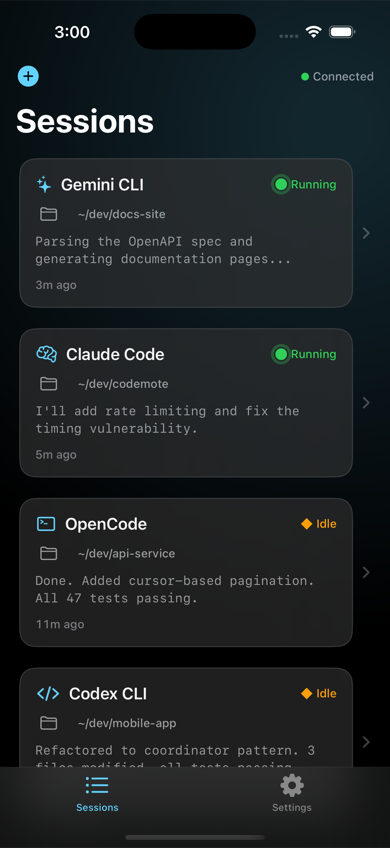
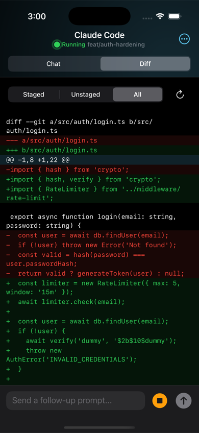
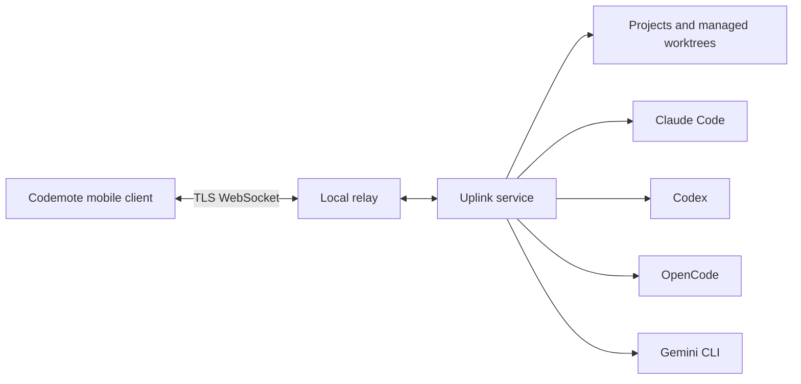

# Codemote

Codemote runs AI coding agents on your machine and lets you supervise them from your phone.

[](https://github.com/codyholm/codemote/actions/workflows/ci.yml)

[](https://www.typescriptlang.org/)
[](https://nodejs.org/)
[](#background-service)

It connects [Claude Code](https://docs.anthropic.com/en/docs/claude-code), [Codex](https://github.com/openai/codex), [OpenCode](https://github.com/anomalyco/opencode), and [Gemini CLI](https://github.com/google-gemini/gemini-cli) through one machine-owned service. Users can start project sessions, follow streaming output, review changes, respond to approvals, and continue work away from their computer.

<p align="center">
  
  
</p>

## How It Works



The service owns project identity, trusted-device state, session lifecycle, and runtime normalization. The phone remains a control surface rather than the source of truth, so reconnects and process restarts do not redefine machine state.

## Engineering Highlights

- Runtime-neutral orchestration across four independent coding-agent CLIs
- Local WebSocket relay with PIN pairing, persisted trust, TLS identity pinning, replay protection, and optional end-to-end encrypted envelopes
- Restart-safe project and managed-worktree starts with durable operation replay and conservative recovery
- Normalized session, approval, and project-attention state across runtimes with different lifecycle semantics
- Interactive and background-service operation across macOS, Linux, and Windows
- Loopback speech-engine integration using Whisper and Kokoro without moving transcripts or source material to a hosted service

## Tech Stack

- **Machine service:** TypeScript, Node.js, Fastify, WebSocket, pnpm
- **Runtime integration:** subprocess orchestration, structured event normalization, Git and worktree operations
- **Transport security:** self-signed TLS identity, pairing trust, replay protection, TweetNaCl envelopes
- **Verification:** Vitest, Biome, TypeScript strict mode

## Repository Scope

This repository contains the machine-side Codemote services: the npm CLI, local relay and runtime-orchestration server, shared TypeScript contracts, and their behavior and security tests.

## Code Organization

- [`packages/cli`](packages/cli) — npm entry point, local service composition, bridge, pairing, transport security, discovery, terminal interface, and operating-system service management
- [`packages/server`](packages/server) — relay routing, runtime execution, sessions, project state, managed worktrees, durable starts, and local speech
- [`packages/common`](packages/common) — shared runtime, session, project, and protocol contracts

## Testing

The TypeScript suite contains 639 tests across 51 files. Fast contract and unit tests run separately from service and Git integration suites so local feedback stays quick without hiding process, socket, or worktree behavior.

```bash
pnpm install --frozen-lockfile
pnpm build
pnpm lint
pnpm typecheck
pnpm test
```

The tiers can also run independently:

```bash
pnpm test:fast
pnpm test:integration
```

The TypeScript workspace requires Node.js 22 or newer and pnpm 9.

## Try Codemote

The published CLI can be started without cloning this repository:

```bash
npx codemote
```

Leave the command running for interactive use, pair it with the native iOS application, then choose a project directory and runtime from the phone. TestFlight access is currently provided directly to invited testers.

### Background Service

After pairing once interactively, install the package globally to register a persistent user service:

```bash
npm install -g codemote
codemote service install
codemote service start
codemote service status
```

The service uses a LaunchAgent on macOS, a user systemd unit on Linux, and Task Scheduler on Windows.

## Copyright and Use

Copyright © 2026 Cody Holm. All rights reserved.
No license is granted to copy, modify, distribute, sublicense, publish, or create derivative works from this code or other repository contents.
